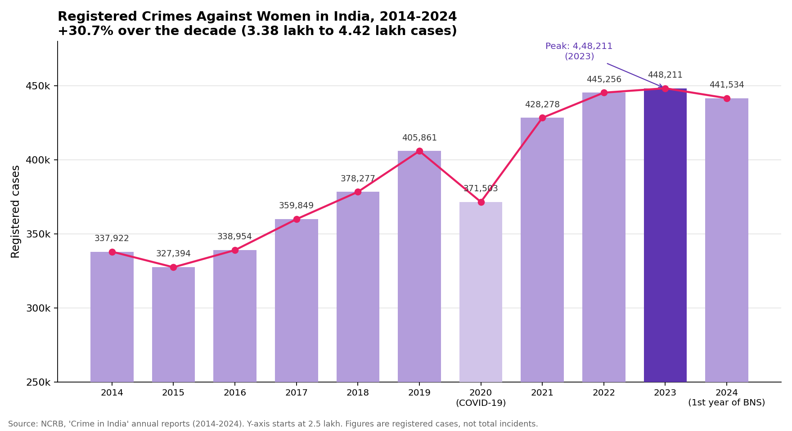

<div align="center">

# Clefairy

</img>

### A Women Safety Application

**One tap. Automatic protection. Help that reaches you faster.**

[](#)
[](#)
[](#)
[](#)
[](#)
[](#)
[](#license)

*Built by Team **Tech10***

[Features](#-key-features) · [Screenshots](#-screenshots) · [Architecture](#-architecture) · [Getting Started](#-getting-started) · [Roadmap](#-future-scope)

</div>

---

## Table of Contents

- [About the Project](#-about-the-project)
- [Problem Statement](#-problem-statement)
- [Our Solution](#-our-solution)
- [Key Features](#-key-features)
- [Screenshots](#-screenshots)
- [Tech Stack](#-tech-stack)
- [Architecture](#-architecture)
- [Project Structure](#-project-structure)
- [Getting Started](#-getting-started)
- [Security & Privacy](#-security--privacy)
- [What Makes Clefairy Different](#-what-makes-clefairy-different)
- [Future Scope](#-future-scope)
- [Team](#-team)
- [Contributing](#-contributing)
- [License](#license)

---

## About the Project

**Clefairy** is a native Android application designed to give women faster, more reliable access to help in emergencies. It combines multiple SOS triggers, live location tracking, an ML-powered safe-route system, an AI safety assistant (**Sakhi AI**), community support, and direct access to verified government help centers, all in one integrated app.

Instead of forcing a user to unlock a phone, find an app, and make a call during a moment of panic, Clefairy is built to act **for** her: automatically detecting distress, alerting trusted contacts, and sharing her live location.

---

## Problem Statement & Cause

Clefairy exists because the numbers below are not abstractions. They are registered cases, which means the real figure is higher, since many women never report.

### The scale (NCRB, Crime in India 2024)

- **4,41,534** crimes against women were registered in 2024, which works out to more than **1,200 a day** ([LatestLY/agency report](https://www.latestly.com/agency-news/india-news-14-years-after-the-nirabhaya-rape-women-continue-to-fear-violence-in-public-spaces-at-home-7629500.html)).
- The biggest categories were cruelty by husband or relatives (**1,20,227**), kidnapping and abduction of women (**67,829**), and assault with intent to outrage modesty (**48,303**) ([same report](https://www.latestly.com/agency-news/india-news-14-years-after-the-nirabhaya-rape-women-continue-to-fear-violence-in-public-spaces-at-home-7629500.html)).
- **2,06,777** rape cases were still pending trial at the end of 2024, and the conviction rate for rape was **24.4%** ([same report](https://www.latestly.com/agency-news/india-news-14-years-after-the-nirabhaya-rape-women-continue-to-fear-violence-in-public-spaces-at-home-7629500.html)).
- Delhi recorded **13,396** cases in 2024, the most among the 19 mega cities, including 1,058 rapes ([The Tribune](https://www.tribuneindia.com/news/delhi/delhi-tops-crime-against-women-among-mega-cities-ncrb-report/)). Delhi Police have attributed part of the high count to free and fair FIR registration ([Deccan Herald](https://www.deccanherald.com/amp/story/india%2Fdelhi%2Fdelhi-tops-metro-cities-in-crimes-against-women-with-13366-cases-in-2023-ncrb-3748479)).

### How reported cases have risen

<div align="center">

</div>

Registered cases rose about **31%** between 2014 and 2024, from 3,37,922 to 4,41,534, and peaked at **4,48,211 in 2023**. The only earlier years that fell were 2015 and the COVID-19 year of 2020 ([Factly](https://factly.in/data-the-number-of-reported-crimes-against-women-increased-by-over-30-between-2014-2022/)). The 2024 figure is a 1.5% dip from 2023, and it is also the first NCRB report under the new Bharatiya Nyaya Sanhita ([Drishti IAS](https://www.drishtiias.com/daily-updates/daily-news-analysis/ncrbs-crime-in-india-2024-report)).

> **How to read this chart:** NCRB counts *registered* cases, so a rise can reflect more crime, more willingness to report, or both. Activists have long argued that reporting has increased while the true rate is much harder to measure ([The Wire](https://thewire.in/gender/conviction-rate-crimes-women-hits-record-low)). The y-axis starts at 2.5 lakh to make year-to-year changes visible. Some early-year figures differ slightly between NCRB editions and secondary sources; we used the values reported in the cited articles.

| Year | Cases | Year | Cases |
|:----:|------:|:----:|------:|
| 2014 | 3,37,922 | 2020 | 3,71,503 |
| 2015 | 3,27,394 | 2021 | 4,28,278 |
| 2016 | 3,38,954 | 2022 | 4,45,256 |
| 2017 | 3,59,849 | 2023 | 4,48,211 |
| 2018 | 3,78,277 | 2024 | 4,41,534 |
| 2019 | 4,05,861 | | |

Sources: [Factly](https://factly.in/data-the-number-of-reported-crimes-against-women-increased-by-over-30-between-2014-2022/) (2014, 2015, 2019, 2020), [The Wire](https://thewire.in/gender/conviction-rate-crimes-women-hits-record-low) (2016), [Outlook](https://www.outlookindia.com/national/india-news-crimes-against-women-in-india-continue-to-rise-up-most-unsafe-news-340881) (2017), [SPRF](https://sprf.in/crimes-against-women-in-india-trends-challenges-and-policy-responses/) (2018), [Deccan Herald](https://www.deccanherald.com/amp/story/india%2Fcrimes-against-women-up-by-15-shows-ncrb-data-1140874.html) (2021), [The Tribune](https://www.tribuneindia.com/news/india/every-hour-52-crimes-against-women-cases-registered-in-india-in-2022-569041/amp) (2022), [National Herald](https://www.nationalheraldindia.com/national/ncrb-2023-report-rise-in-crimes-against-women-cybercrime-farmer-suicides) (2023), [LatestLY](https://www.latestly.com/agency-news/india-news-14-years-after-the-nirabhaya-rape-women-continue-to-fear-violence-in-public-spaces-at-home-7629500.html) (2024).

### Recent cases that shook the country

| When | Where | What happened | Source |
|------|-------|---------------|--------|
| Sept 2026 | Delhi | Three men posing as police officers allegedly gang-raped a 17-year-old girl in a public park, sparking student protests. This followed the rape and murder of a 16-year-old and the alleged rape of a 17-year-old by a bus driver and conductor in recent weeks. | [AFP via Manila Times](https://www.manilatimes.net/2026/09/26/world/asia-oceania/india-rape-cases-turn-focus-on-womens-safety/2433055), [NewsX](https://www.newsx.com/photos/india/from-park-horror-to-mass-protests-how-delhi-erupted-after-aastha-kunj-gang-rape-case-277783/) |
| Sept 2026 | Punjab | Violent protests at Lovely Professional University over an alleged rape on campus; classes were suspended for 10 days. University officials deny the claim and police are investigating. | [Al Jazeera](https://www.aljazeera.com/news/2026/9/28/indian-university-suspends-classes-amid-violent-protests-over-alleged-rape) |
| July 2026 | Baruipur, West Bengal | The rape and murder of a girl led to widespread unrest, the mob killing of an innocent man, and the death of the main suspect in police custody. | [CNN](https://www.cnn.com/2026/07/10/india/india-west-bengal-girl-rape-murder-intl-hnk) |
| May 2026 | Sulur, Coimbatore, Tamil Nadu | A ten-year-old girl was raped and murdered; two men were arrested. | [Wikipedia (with linked news sources)](https://en.wikipedia.org/wiki/Sulur_rape_and_murder_case) |
| Aug 2024 | Dhing, Assam | The gang rape of a 14-year-old girl led to protests across the state. | [Wikipedia (with linked news sources)](https://en.wikipedia.org/wiki/2024_Dhing_gang_rape_case) |
| Aug 2024 | Kolkata, West Bengal | A postgraduate trainee doctor was raped and murdered on duty at RG Kar Medical College and Hospital, triggering prolonged nationwide protests. The convict was sentenced to life imprisonment in January 2025, and appeals are ongoing. | [PTI via Careers360](https://news.careers360.com/rg-kar-case-sanjay-roy-sentenced-life-imprisonment-till-death-in-rape-murder-of-doctor), [Medical Dialogues](https://medicaldialogues.in/news/health/doctors/cbi-submits-sealed-report-on-alleged-conspiracy-in-rg-kar-doctor-rape-murder-case-180002) |
| 2018 | Kathua, Jammu and Kashmir | An eight-year-old girl was gang-raped and murdered inside a temple, prompting nationwide protests in April 2018. | [Al Jazeera](https://www.aljazeera.com/news/2018/4/15/india-nationwide-protests-to-demand-justice-for-rape-victims) |
| Dec 2012 | Delhi | The Nirbhaya case: a 23-year-old student was gang-raped on a city bus, leading to nationwide protests and stronger rape laws. | [NPR](https://www.npr.org/2012/12/18/167552362/rape-case-in-india-provokes-widespread-outrage) |

Each of these cases drew public outcry, and AFP notes the recent Delhi cases brought arrests and political condemnation. Yet campaigners and lawyers quoted by AFP say the problem is largely enforcement: overstretched police, slow courts, and a rape conviction rate that has hovered around a quarter of cases that reach trial since 2012 ([AFP via Manila Times](https://www.manilatimes.net/2026/09/26/world/asia-oceania/india-rape-cases-turn-focus-on-womens-safety/2433055)).

### What this means for Clefairy

Laws and punishments act *after* harm. Women need something that works **during** the moment, when she cannot unlock a phone, find an app, or make a call. That gap between the crime and the response is the cause Clefairy was built for: automatic detection, one-tap alerts, live location sharing, and direct access to verified help.

*Case details are drawn from news reports; where a case is still under investigation or trial, it is described as alleged.*
---

## Our Solution

Clefairy brings prevention, detection, and response into a single app:

| Stage | What Clefairy does |
|-------|--------------------|
| **Prevent** | ML-based safest-route suggestions, daily safety tips and risk-based guidance |
| **Detect** | Sensor-based motion anomaly detection and distress audio detection |
| **Respond** | One-tap / triple-click / automatic SOS, emergency SMS, live location sharing, audio recording |
| **Support** | Sakhi AI assistant, community feed, helplines, and government help center directory |

---

## Key Features

### Multiple SOS Triggers
- **One-Tap SOS**: single tap to trigger an emergency alert
- **Triple-Click SOS**: discreet trigger without opening the app
- **Sensor-Based SOS**: uses device sensors to detect abnormal motion
- **Automatic SOS**: motion anomaly plus distress audio detection
- GPS location is captured and shared automatically
- **Cancel option** to stop false alarms

### Live Track Me and Automatic Travel SOS
- SOS protection stays **active for the entire journey** until the user reaches her destination
- Any disruption that stops the user's movement or deviates from the route can trigger an alert
- Shows current location, destination, ETA, and distance

### ML-Based Safe Route Finder
- Suggests the **safest route** instead of just the shortest one
- Powered by a scikit-learn risk-score prediction model served through FastAPI

### Sakhi AI, Your Safety Assistant
- AI assistant trained for women's safety scenarios
- Understands requests like *"I'm in danger, please send my current location to my contacts"*
- Helps locate the nearest One Stop Centre (OSC) and guides the user step by step

### Emergency SMS
- Sends alerts to registered trusted contacts (family, friends, etc.)
- Includes the user's live location

### Audio Recording
- One-tap evidence recording during an incident

### Helplines and Government Support
- National and common helpline numbers in one place
- Directory of official support bodies, including:
  - One Stop Centre (OSC) Administrators and SNOs
  - Shakti Sadan and Shakti Sadan SNOs
  - Protection Officers
  - Child Marriage Prohibition Officers
  - Anti-Human Trafficking Unit
  - District Programme Officers

### Community and Awareness
- Community feed with posts, comments, and people
- Daily safety awareness tips and risk-based guidance
- Integrates schemes such as **BBBP**, **OSC**, and **MRY** on the home screen

### Secure Onboarding
- Registration with name, Aadhaar number, email, and password
- Verified user profiles
- End-to-end encrypted personal messages

---

## Screenshots

### Onboarding & Authentication

| Splash | Register | Login |
|:------:|:--------:|:-----:|
| <!-- 📸 -->  | <!-- 📸 -->  | <!-- 📸 -->  |

### Home & Profile

| Home | Profile / Quick Actions | Settings |
|:----:|:-----------------------:|:--------:|
| <!-- 📸 -->  | <!-- 📸 -->  | <!-- 📸 -->  |

### Emergency Features

| SOS | Record | Live Track Me |
|:---:|:------:|:-------------:|
| <!-- 📸 -->  | <!-- 📸 -->  | <!-- 📸 -->  |

| Emergency SMS | Helpline Numbers |
|:-------------:|:----------------:|
| <!-- 📸 -->  | <!-- 📸 -->  |

### AI & Community

| Sakhi AI | Safety Tips | Communities |
|:--------:|:-----------:|:-----------:|
| <!-- 📸 -->  | <!-- 📸 -->  | <!-- 📸 -->  |

### Government Help Centers

| Help Center Directory |
|:---------------------:|
| <!-- 📸 -->  |


---

## Tech Stack

| Layer | Technology |
|-------|-----------|
| **Mobile App** | Android (Kotlin, Native) |
| **Android System Components** | SensorManager, Location Services, Foreground Services |
| **Maps** | Google Maps SDK for live location tracking |
| **Backend** | FastAPI (Python), REST APIs |
| **Machine Learning** | scikit-learn (risk score prediction) |
| **Auth & Database** | Firebase |
| **Networking** | Retrofit |
| **Security** | JWT-based authentication and encryption |
| **Architecture** | MVVM |
| **UI/UX Design** | Figma |

---

## Architecture

```
┌──────────────────────┐        REST (Retrofit)        ┌──────────────────────┐
│   Android App        │  ───────────────────────────▶ │   FastAPI Backend    │
│   (Kotlin, MVVM)     │  ◀───────────────────────────  │   (Python)           │
│                      │           JSON / JWT          │                      │
│ • SensorManager      │                               │ • Auth (JWT)         │
│ • Location Services  │                               │ • Risk score API     │
│ • Foreground Service │                               │ • scikit-learn model │
│ • Google Maps SDK    │                               └──────────┬───────────┘
└──────────┬───────────┘                                          │
           │                                                      │
           ▼                                                      ▼
   ┌──────────────┐                                     ┌──────────────────┐
   │   Firebase   │                                     │  Safe-Route /    │
   │ Auth + DB    │                                     │  Risk Prediction │
   └──────────────┘                                     └──────────────────┘
```

---

## Project Structure

```
women-safety-app/
├── android-app/     # Native Android application (Kotlin, MVVM)
├── backend/         # FastAPI service and ML risk-prediction model
├── ui design/       # Figma / UI design assets
├── .gitignore
└── README.md
```

---

## Getting Started

### Prerequisites

- Android Studio (latest stable)
- JDK 17+
- Python 3.10+
- A Firebase project
- A Google Maps API key

### 1. Clone the repository

```bash
git clone https://github.com/DHRUVxMISHRA/women-safety-app.git
cd women-safety-app
```

### 2. Backend setup

```bash
cd backend
python -m venv venv
source venv/bin/activate        # Windows: venv\Scripts\activate
pip install -r requirements.txt
uvicorn main:app --reload
```

The API will be available at `http://127.0.0.1:8000`, with interactive docs at `/docs`.

Create a `.env` file in `backend/`:

```env
JWT_SECRET=your_secret_key
FIREBASE_CREDENTIALS=path/to/serviceAccountKey.json
```

### 3. Android app setup

1. Open the `android-app/` folder in **Android Studio**.
2. Add your `google-services.json` to `android-app/app/`.
3. Add your Google Maps API key in `local.properties`:
   ```properties
   MAPS_API_KEY=your_google_maps_api_key
   ```
4. Set the backend base URL in the Retrofit configuration (use `http://10.0.2.2:8000` for the Android emulator).
5. Sync Gradle, then **Run** on an emulator or physical device.

### Required Permissions

| Permission | Purpose |
|-----------|---------|
| Location (fine and background) | Live tracking and SOS location sharing |
| SMS | Emergency alerts to trusted contacts |
| Microphone | Audio recording and distress detection |
| Foreground Service | Continuous protection during travel |
| Sensors | Motion anomaly detection |

---

## Security & Privacy

- JWT-based authentication for API access
- Encrypted data handling
- End-to-end encrypted personal messages
- Verified user profiles
- Sensitive keys and credentials are excluded via `.gitignore` and must never be committed

---

## What Makes Clefairy Different

- Three SOS modes in one app: One Tap, Sensor-Based, and Triple Click
- **Automatic SOS** using motion anomaly and distress audio detection
- **ML-based safest route** finding, not just shortest route
- SOS that stays active for the whole journey
- Emergency SMS, helplines, and audio recording built in
- Community support combined with government help centers
- **Sakhi AI**, an assistant trained for women's safety
- Daily safety awareness and risk-based guidance

---

## Future Scope

- 💍 Smart ring and wearable device integration for hands-free SOS activation
- 🧠 Advanced AI-based risk prediction
- 📢 Safety awareness campaigns
- 🛍️ App-related safety merchandise
- 🤝 Large-scale deployment through partnerships with NGOs, educational institutions, and government initiatives

---

## Team

**Team Tech10**

| Name | Role | GitHub |
|------|------|--------|
| Dhruv Mishra | Developer | [@DHRUVxMISHRA](https://github.com/DHRUVxMISHRA) |
| Mohammad Sohail Ali | Backend Developer | [@MdSohailAli3](https://github.com/MdSohailAli3) |
| Ali Akbar Khan | UX/UI Designer | [@aliiakbarkhan](https://github.com/aliiakbarkhan) |
| Yash Mishra | ML Engineer | [@YaashxMishra](https://github.com/YaashxMishra) |

---

## Contributing

Contributions are welcome.

1. Fork the repository
2. Create a feature branch: `git checkout -b feature/your-feature`
3. Commit your changes: `git commit -m "Add your feature"`
4. Push to the branch: `git push origin feature/your-feature`
5. Open a Pull Request

---

## License

Distributed under the MIT License. See `LICENSE` for more information.

---

<div align="center">

**Built with 💜 for a safer tomorrow.**

If you find this project useful, please consider giving it a ⭐

</div>
